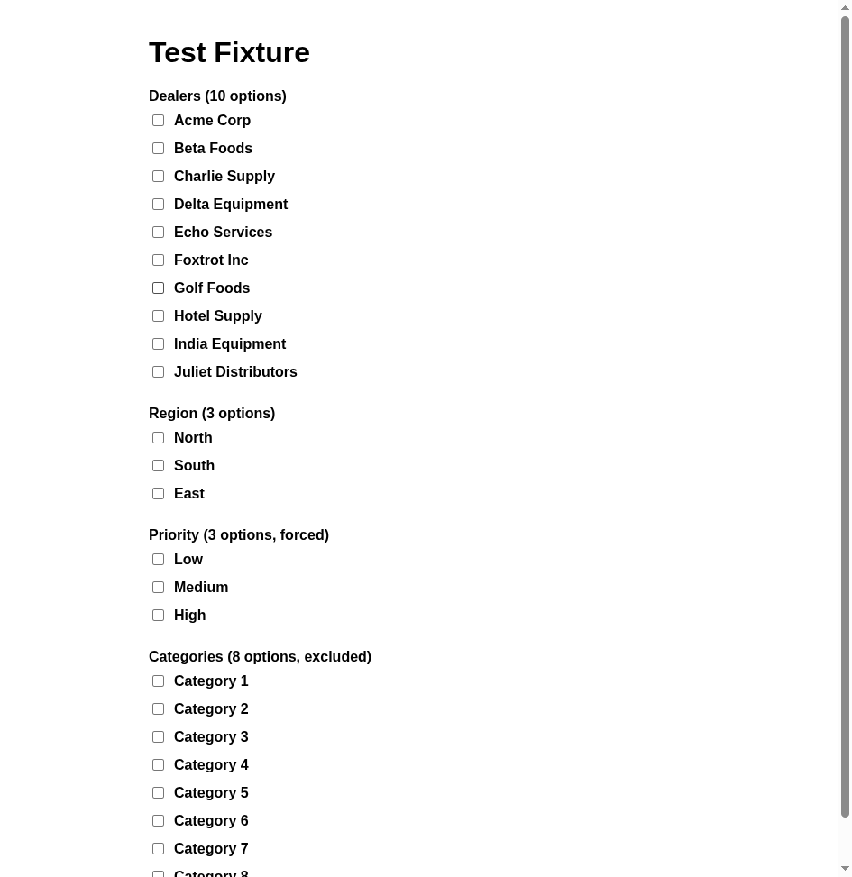
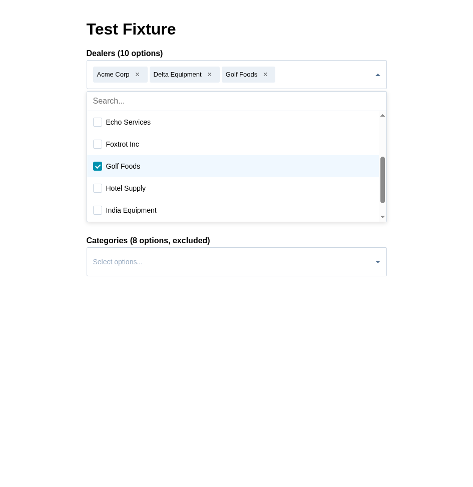

# Multiselect to Combobox

Converts HubSpot `hsfc-CheckboxFieldGroup` multi-select checkboxes into searchable, accessible combobox dropdowns with multi-select capability.

Designed to be dropped into a HubSpot form as a single JS snippet — no build tools, no dependencies.

| Before | After |
|---|---|
|  |  |

## Features

- **Searchable dropdown** — filter options by typing
- **Multi-select with pills** — selected items display as removable tags
- **Automatic initialization** — watches the DOM for HubSpot form elements to load, then converts them
- **Mobile friendly** — 44px touch targets, viewport-aware dropdown height, "Done" button on touch devices
- **Accessible** — full keyboard navigation, ARIA attributes, screen reader announcements via live region
- **Configurable** — target specific checkbox groups by ID, customize pill colors
- **Non-destructive** — original checkboxes are hidden but still toggled, so HubSpot form submission works normally

## Usage

### As an external script

```html
<script src="multiselect-to-combobox.js"></script>
```

### As an inline snippet (HubSpot custom code)

Copy the contents of `multiselect-to-combobox.snippet.html` directly into your HubSpot page's custom code section. This is the same script pre-wrapped in a `<script>` tag.

## Configuration

Edit the `CONFIG` object at the top of the file:

```js
const CONFIG = {
  minOptions: 6,            // only convert groups with at least this many options (0 = convert all)
  targetIds: [],            // always convert these groups regardless of minOptions
  excludeIds: [],           // never convert these groups even if they meet the threshold
  pillBg: "",               // pill background color, e.g. '#0091ae'
  pillColor: "",            // pill text color, e.g. '#fff'
  pillRemoveColor: "",      // X button color, defaults to pill text color at 60% opacity
  pillRemoveHoverColor: "", // X button hover color, defaults to pill text color at full opacity
};
```

| Option | Type | Default | Description |
|---|---|---|---|
| `minOptions` | `number` | `6` | Only convert groups with at least this many checkboxes. Set to `0` to convert all regardless of count. |
| `targetIds` | `string[]` | `[]` | Always convert these groups by ID, even if they have fewer than `minOptions` options. |
| `excludeIds` | `string[]` | `[]` | Never convert these groups by ID, even if they meet the `minOptions` threshold. |
| `pillBg` | `string` | `""` | Background color for selected item pills. Uses default light gray when empty. |
| `pillColor` | `string` | `""` | Text color for selected item pills. Inherits from parent when empty. |
| `pillRemoveColor` | `string` | `""` | Color of the X remove button. Defaults to the pill text color at 60% opacity. |
| `pillRemoveHoverColor` | `string` | `""` | Hover color of the X remove button. Defaults to the pill text color at full opacity. |

All pill styles can also be overridden via CSS custom properties: `--mscombo-pill-bg`, `--mscombo-pill-color`, `--mscombo-pill-remove-color`, `--mscombo-pill-remove-hover-color`.

## Keyboard Navigation

| Key | Action |
|---|---|
| `Enter` / `Space` | Open/close dropdown (on trigger), toggle option (in list) |
| `Arrow Down` | Open dropdown or move to next option |
| `Arrow Up` | Move to previous option |
| `Home` / `End` | Jump to first/last option |
| `Escape` | Close dropdown and return focus to trigger |
| `Tab` | Close dropdown and move to next form field |

## Accessibility

- `role="combobox"` on trigger with `aria-expanded`, `aria-controls`, and `aria-label` pulled from the HubSpot field label
- `role="listbox"` with `aria-multiselectable="true"` on the options container
- `role="option"` with `aria-selected` on each option row
- `aria-activedescendant` tracks the keyboard-focused option
- Pill remove buttons have `role="button"`, `tabindex="0"`, and descriptive `aria-label`
- Live region (`aria-live="polite"`) announces selections and removals to screen readers
- Visible focus indicators on all interactive elements

## How It Works

1. The script runs immediately and begins watching the DOM with a `MutationObserver`
2. When `.hsfc-CheckboxFieldGroup` elements appear (i.e., the HubSpot form finishes loading), they are converted
3. The original checkbox inputs are hidden but remain in the DOM — clicking a combobox option toggles the underlying checkbox and fires `change`/`input` events
4. HubSpot's form submission picks up the checkbox values as normal
5. The observer stays active to handle React hydration re-renders that may replace the DOM after initial load

## Testing

```bash
pnpm install
pnpm test
```

Tests use [Playwright](https://playwright.dev/) and cover conversion rules, UI behavior, selection, keyboard navigation, and accessibility.
